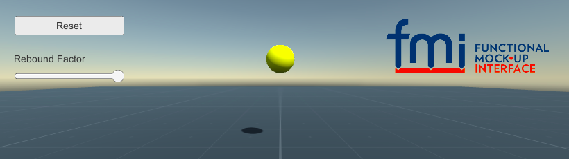

# Unity FMI Add-on

[Functional Mock-up Interface](https://fmi-standard.org/) for [Unity](https://unity3d.com/)

## Getting Started

Download and import the [Unity package](https://github.com/CATIA-Systems/Unity-FMI-Addon/releases). Select `Assets > Import FMU` to import the FMU.
This creates the model description in `Resources` that lists the available variables and extracts the FMU to the
`StreamingAssets` folder.

Now you can use the FMU the in your scripts (see [BouncingBall.cs](Assets/SampleScenes/BouncingBall/BouncingBall.cs) for a complete example):

```csharp
public class BouncingBall : MonoBehaviour {

    FMU fmu;

    void Start () {
        fmu = new FMU2("bouncingBall");
        fmu.SetupExperiment(Time.time);
        fmu.EnterInitializationMode();
        fmu.ExitInitializationMode();
    }

    void FixedUpdate() {
        fmu.DoStep(Time.time, Time.deltaTime);
        transform.position = Vector3.up * (float)fmu.GetReal("h");
    }

}
```

The example scene `SampleScenes/BouncingBall` shows you how to instantiate and reset the model, set input and get output.



[Values.cs](Assets/SampleScenes/Values/Values.cs) demonstrates how to use value references and to get and set `Real`, `Integer`, `Boolean` and `String` variables.


## Limitations

Currently the FMI add-on supports only a limited subset of FMI 2.0 for co-simulation API. It runs on Mac and 64-bit Windows (make sure you select `x86_64` as architecture when exporting the player on Windows).


## Get DotNetZip.dll

If you've cloned the repository you need to download [dotnetzip.1.11.0.nupgk](https://www.nuget.org/api/v2/package/DotNetZip/1.11.0), extract it (it's a ZIP archive) and copy `DotNetZip.dll` in `lib/net20` to `Unity/Assets/FMI/Editor/Plugins`. This library is required to extract FMUs during the import. DotNetZip.dll is already included in the pre-built Unity package.


## Contributing

You've found a problem? Fantastic, a problem found is a problem fixed. Please take a moment to read the [contributing guide](CONTRIBUTING.md) before you [open an issue](https://github.com/CATIA-Systems/Unity-FMI-Addon/issues).


## License

The code is licensed under the [BSD 3-clause license](LICENSE.md). Copyright &copy; 2018 Dassault Syst&egrave;mes. All rights reserved.
